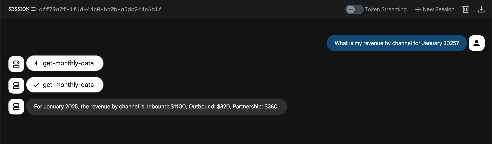

# 🤖 Vasco AI Challenge

## Overview

During this challenge, you are expected to implement new features on an AI assistant providing information about the revenue of a company.

The project already includes:

- An MCP server in TypeScript, that has one tool returning raw data.
- An ADK server in Python: a chatbot agent using the MCP server.

## Setting up the local development environment

### Running the MCP Server

- `cd mcp`
- `npm install`
- To start the MCP server: `npm run start`
- To start the MCP inspector: `npm run mcp-inspector`

### Running the ADK Server

- `cd adk`
- `python3 -m venv .venv`
- `source .venv/bin/activate`
- `pip install -r requirements.txt`
- `cp ./main/.env.example ./main/.env`
- Add a Gemini API key to the `.env` file (`GOOGLE_API_KEY`)
- To start the ADK server: `adk web --port 8000`

### Testing that everything works together

- Open the [ADK playground](http://127.0.0.1:8000/dev-ui/)
- Ask "What is my revenue by channel for January 2025?"
- The chatbot should respond with the revenue for January 2025 for all channels:



### Use of AI Development Tools

You're encouraged to use AI tools like Claude Code or Cursor to move faster at home. At Vasco, we care about code quality, clarity, and reasoning — not how you get there.

> Use AI to accelerate your work, but ensure the result reflects your own understanding and craftsmanship. We'll test that live.

Be ready to explain your choices and adapt your code **without AI** in the live session.

**Optional:** We’re curious how you used AI while working on this challenge — what helped, what didn’t. If you’d like, keep your prompts or spec files so we can discuss them during the live interview.

## Your tasks

You need to implement three capabilities for the AI assistant:

### Capability 1 — Understand and compute ARR from new MRR

When asked "What is my current ARR?", the assistant should recognize that the provided dataset represents new MRR each month.

It should be able to:

- Accumulate monthly MRR starting from $0 ARR.
- Multiply the cumulative MRR by 12 to produce ARR.
- Present a concise, natural-language explanation alongside the result.

For example, using all 2024 + 2025 data up to December 2025, the correct logic would yield:

```math
ARR = 12 × ∑(monthly MRR)
```

### Capability 2 — Fiscal-year awareness driven by user input, with persistence across threads

The assistant must correctly answer fiscal-period questions such as "What was my ARR in Q2 2024?".

It should not rely on a constant or hard-coded fiscal-year start month.

If the fiscal-year start month is unknown, it must ask the user directly (e.g., "Which month does your fiscal year start? 1 = January … 12 = December").

Once the user provides it, the assistant should remember and persist that preference for subsequent interactions and new conversations.

Using the provided month, it should translate fiscal quarters to the correct calendar ranges (for example, if the fiscal year starts in April → Q2 FY2024 = July–September 2024).

It must then compute ARR at the end of that fiscal period using the same cumulative logic as Capability 1.

### Capability 3 — Generate a reasoned executive report with voice and judgment

When asked "Write me an executive report on my best channel — which one I should double down on and which I should divest, and why", the assistant should:

- Analyze the dataset to identify:
  - The best-performing channel (highest or fastest-growing).
  - The least-performing channel (lowest or stagnating).
- Provide a short, coherent narrative that:
  - Explains the comparison quantitatively (totals, trends, growth).
  - Offers qualitative insight on where to invest or reduce effort.
- Deliver the report in the tone and cadence of Morgan Freeman — calm, reflective, cinematic, and persuasive.

---

*In the end, it’s not the lines of code that matter, but the story they tell. — Morgan Freeman*
