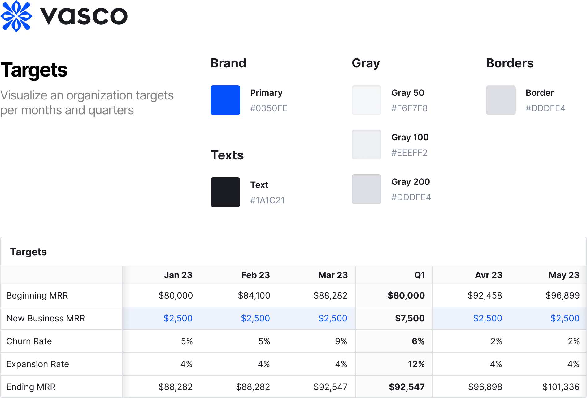

# Frontend Challenge

Welcome to Vasco's frontend challenge. You are tasked with visualizing an organization's targets per month and quarter. The challenge is divided into multiple levels, increasing in complexity. You can install any library you see fit.

## Level 1

We expect a static version of the table shown in the picture (only months, no quarters). The first column should be sticky, and the table should be scrollable horizontally.

Bonus points if it respects our design system and adapts to different screen sizes. Be mindful of the time; we want to see level 4.

## Level 2

We expect the data of the table to be fetched from an API. The data is available in the `data` folder.

## Level 3

We expect the blue cells to be editable, and all other cells should recalculate accordingly. Here are the formulas to use:

```math
beginningMRR = endingMRR(m-1)
```

```math
endingMRR = beginningMRR + newBusinessMRR + churnedMRR + expansionMRR
```

```math
churnedMRR = beginningMRR * churnRate
```

```math
expansionMRR = beginningMRR * expansionRate
```

### Notes

- The first month's beginningMRR is always the one from the API (i.e. $80,000)
- The notation `m-1` means the previous month

## Level 4

We expect to now see quarter columns. The data should come from the following formulas:

```math
quarterlyBeginningMRR = beginningMRR(m1)
```

```math
quarterlyNewBusinessMRR = SUM(newBusinessMRR)
```

```math
quarterlyChurnRate = quarterlyChurnedMRR / quarterlyAverageBeginningMRR
```

```math
quarterlyExpansionRate = quarterlyExpansionMRR / quarterlyAverageBeginningMRR
```

```math
quarterlyEndingMRR = endingMRR(m3)
```

---

```math
quarterlyChurnedMRR = beginningMRR(m1) * churnRate(m1) + beginningMRR(m2) * churnRate(m2) + beginningMRR(m3) * churnRate(m3)
```

```math
quarterlyExpansionMRR = beginningMRR(m1) * expansionRate(m1) + beginningMRR(m2) * expansionRate(m2) + beginningMRR(m3) * expansionRate(m3)
```

```math
quarterlyAverageBeginningMRR = (beginningMRR(m1) + beginningMRR(m2) + beginningMRR(m3)) / 3
```

### Notes

- The notation `m1` means the first month of the quarter, `m2` the second month and `m3` the third month.

## Level 5

Do you still have some time? You are tasked with writing an RFC to technically shape a proposed change. The change involves the requirements to make the formulas calculation reusable also in the backend. For example, if the backend wants to calculate the Churn Rate, it should be able to use the same formulas as the frontend.

In the RFC, please specifically include your proposed solution for:

- Having isomorphic formulas.
- How to add new formulas overtime.
- How the developer would use the formulas.
- We expect pseudo-code, not a full implementation.
- Include the pros and cons of your solution.
